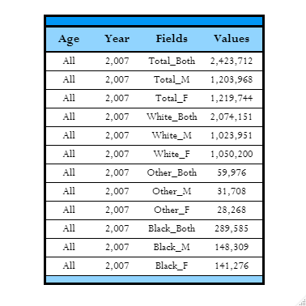
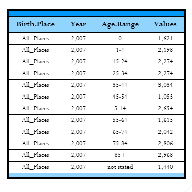

# Data Wrangling of Mortality Tables

The objective of this project is to create a better structure of data from multiple, messy, csv files.
These files pertain to CDC morality tables in the United States spanning from 1999 to 2007. This was accomplished with the purrr package rather than iterating through with a for-loop

There are two main groups of data:

* Demographics
* Residents by Age

and their resulting structures can be seen below for the year 2007.

## Demographics

## Residents by Age

